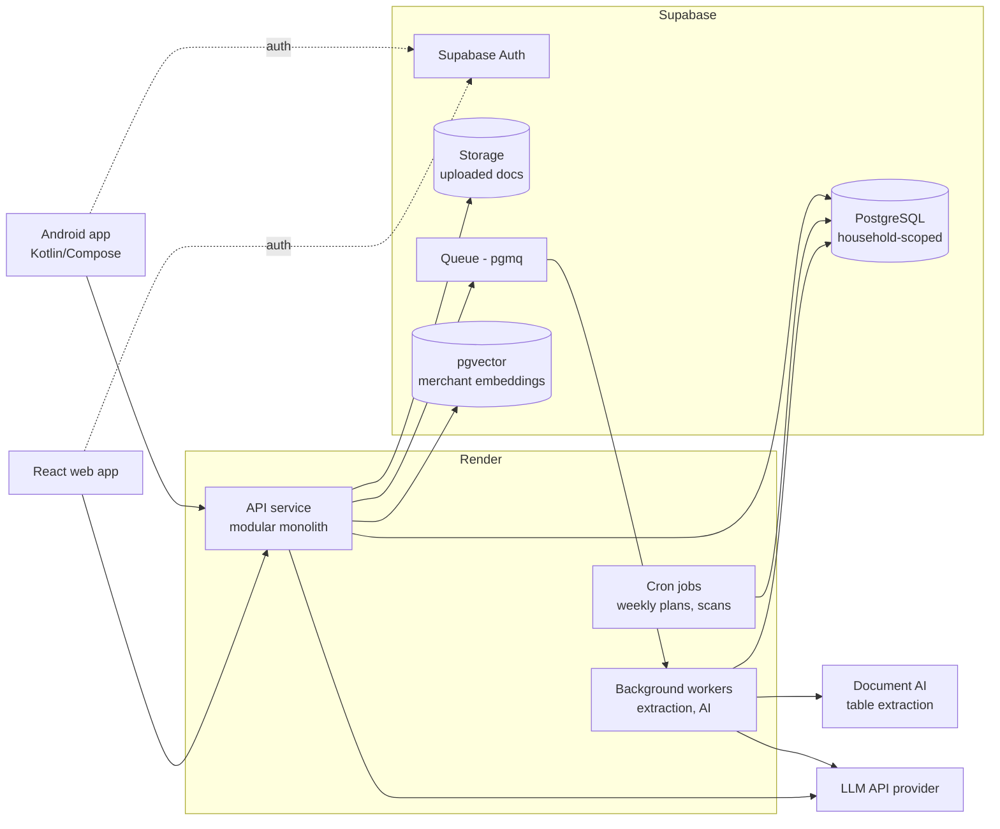
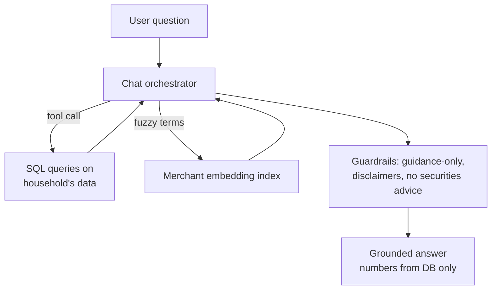
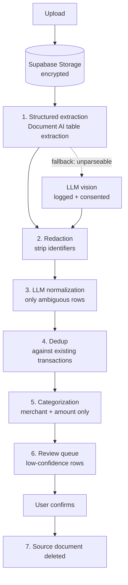

# AI Finance Tracker — Product Requirements Document

**Status:** Draft v1.1 · **Date:** 2026-08-27 (v1.0: 2026-08-22) · **Source:** Client brief "AI Budgeting & Investment Platform – Product Brief (Developer Overview)" + manager interview
**Owner:** Product/Engineering manager · **Audience:** the build team; tickets reference sections of this document.

---

## 1. Overview & Vision

An AI-powered personal-finance platform that acts as a **money coach / decision-support system**, not just an expense tracker. Users bring their financial data (uploaded statements and screenshots in v1); the platform automatically extracts and categorizes transactions, generates budgets from real behavior, tracks goals and debt, scores financial health, and answers questions through an AI chatbot grounded in the user's actual numbers.

The long-term vision (client's words): a full money-management ecosystem — budgeting, savings, debt, split expenses, and investments — that grows more personalized over time and becomes the user's primary financial decision-support tool.

**Positioning (locked):** The product is **educational guidance and decision-support, not regulated financial advice**. Platform-wide disclaimers; the AI never gives individualized securities recommendations ("buy stock X"). This is the industry-standard posture (Mint, YNAB, Monarch, Copilot) and the only version that ships in G7 markets without financial-advisor licensing. The brief's "Taxes Evasion" section is renamed **Tax Optimization** and framed as education about tax-advantaged account *types* (RRSP/TFSA/FHSA etc.), not personal tax advice.

## 2. Goals & Non-Goals

### Goals (v1)
1. A user can sign up in ~30 seconds and complete a skippable financial-setup wizard (income, debts, investments, obligations).
2. A user can upload bank statements/screenshots/PDFs and get accurately extracted, categorized transactions with a correction loop that improves per-user accuracy.
3. The system auto-generates a personalized budget from real spending history and keeps it current.
4. Users create and track short- and long-term goals with deterministic progress math.
5. A dashboard shows a Money Health Score and spending insight.
6. An AI chatbot answers financial questions using the user's real data, with numbers always sourced from the database (never hallucinated).
7. Free/paid entitlement gating works from day one.

### Non-Goals (v1 — explicitly out, phased later)
- Bank account linking / aggregator integration (Phase 2 — schema is aggregator-ready from day one).
- Debt payoff optimizer, subscription tracking, safe-to-spend, weekly AI tasks, alerts (Phase 2).
- **The React web client** — mobile (Android + iOS) ships first; web follows once the API is proven.
- Split expenses, challenges/gamification, what-if simulator, investment tracking, tax optimization module, education hub, Family Plan UI, WhatsApp notifications (Phase 3+).
- Moving money in any form: no payments, transfers, trading, or brokerage integration — ever in scope without a separate business decision.
- Personalized regulated financial/investment advice.
- Custom ML model training. All AI is LLM-API-based.

## 3. Target Users & Roles

- **Primary user (v1):** an individual consumer in **Canada** managing personal finances. Single role; owns all their data.
- **Household member (post-v1, Family Plan):** second user sharing dashboards, budgets, and goals. The **data model supports households from day one** (v1 households always have exactly one member); only the sharing UI is deferred.
- **Admin (internal):** support/ops tooling, minimal in v1 (user lookup, entitlement fixes).

## 4. System Architecture

### 4.1 Platform (locked)
- **Mobile:** **Kotlin Multiplatform** (repo `FinAI-Mobile-2026`) — shared Kotlin business logic with **native UI on both platforms**: Android in Jetpack Compose, iOS in SwiftUI, bridged by SKIE. **No shared UI module.** Android and iOS both ship in v1 with feature parity as the default.
- **Web:** **React** SPA (separate repo) — **deferred, not in v1.** Mobile ships first; the web client follows once the API has been proven by the mobile build. Repo not yet created.
- **Desktop:** explicitly out of scope — the web app will be the desktop experience when it ships. Recorded as a decision, not a silent skip.
- All clients consume one shared backend API. Clients hold **no server-authoritative financial math**: health score, budget allocations, goal projections, debt schedules and spending aggregates are computed by the Render API and displayed by the client. Shared KMP logic owns validation, blocking reasons, projections of API responses into screen state, filtering, and formatting — everything that could otherwise differ between Android and iOS.
- Mobile conventions are governed by the **`kmp-arch-v2`** architecture guide and the repo's `CLAUDE.md`.

### 4.2 Backend & infrastructure (locked)

**Supabase is the data platform; Render runs the application backend.**

| Concern | Platform |
|---|---|
| PostgreSQL (system of record), migrations, `pgvector` embedding index | Supabase |
| Auth — signup, JWT issuance, phone/OTP | Supabase Auth |
| Object storage for uploaded documents (pre-deletion) | Supabase Storage |
| Job queue (`pgmq` / Supabase Queues) — lives beside the data | Supabase |
| API service (modular monolith) | Render web service |
| Extraction & AI background workers | Render background worker service(s) |
| Scheduled work (weekly plans, subscription scans, notification batches) | Render cron jobs |

**Why this split:** the extraction pipeline is long-running, multi-step, retry-heavy work (document extraction → redaction → LLM normalization → dedup → categorization → recompute). Serverless functions cap out on wall clock and would leave partially-imported statements in users' financial records on failure. Render background workers have no such limit, give us cron and normal observability, and leave the backend language open. Supabase remains the data platform because the product's architecture depends on Postgres (see §4.5: SQL-grounded chatbot, relational financial integrity, `pgvector`).

**Rules this imposes on the build:**
- **Clients never talk to the database directly.** All reads and writes go through the Render API so authorization, entitlement gating, and audit logging live in one place.
- **Row Level Security stays enabled anyway**, as defense in depth.
- **The Supabase `service_role` key exists only in backend environment variables** — never in the Android app, never in the React bundle.
- **Render services and the Supabase project run in the same region** (see *Regions* below) — every query is a network hop; same-region keeps it single-digit milliseconds.
- Render's free tier is not used for the API (it sleeps on inactivity); paid tier from the start.
- Clients authenticate against Supabase Auth; the Render API verifies the issued JWT against Supabase's JWKS. No custom auth is built.

**Regions (locked): Supabase US East (Virginia) + Render Virginia — one region, all markets.**

Virginia is the best single compromise across the four target markets, not merely a US default. Approximate user→API round trip:

| Market | Virginia | Ireland/London (the alternative) |
|---|---|---|
| Canada (launch) | 15–25ms | 70–80ms |
| US | 10–40ms | 75–140ms |
| UK | 75–90ms | 10–20ms |
| EU | 85–100ms | 20–35ms |

The population and revenue centroid of Canada + US + UK + EU sits in North America, so Virginia loses ~60ms in Europe to win ~60–90ms in North America. An EU-hosted alternative would only be right if Europe were the dominant market. Latency in Europe is tolerable here because the expensive work — extraction, weekly plans, AI generation — is **asynchronous background processing**; only dashboard reads and chat are synchronous, and chat is dominated by LLM response time.

Canadian data residency was considered and rejected as unnecessary: PIPEDA imposes no residency requirement, and Quebec Law 25's transfer assessment is required regardless because Render has no Canadian region. Note that Supabase cannot change a project's region in place — revisiting this after launch means a migration with downtime, so the decision is deliberate now.

**A second region is a trigger, not a schedule.** One region may serve indefinitely. Stand up an EU region (**Frankfurt — offered by both Supabase and Render, so it is a same-region mirror with the same vendors and code**) when any of these occurs:

1. A legal or partner demand for EU data residency (bank partnership, enterprise deal, regulator).
2. **The EU–US Data Privacy Framework is invalidated** (its two predecessors, Safe Harbor and Privacy Shield, both were — see Appendix A.4). The UK Data Bridge rests on the same foundation, so treat these as one trigger, not two.
3. EU/UK revenue share grows enough that ~90ms measurably costs conversion.

**Multi-region readiness — build these now, they are cheap and make region two a deployment rather than a rewrite:**
- **UUID primary keys.** No global sequences that assume a single database.
- **`household.country_code` is the routing key** — already required for feature gating (§4.6).
- **Config-driven connections.** Supabase URL/keys and API base URL come from deployment environment, never hardcoded.
- **No cross-region assumptions.** A household lives in exactly one region; never write a query that spans them.
- **Known unsolved problem, to be decided *before* region two, not after:** separate regional Supabase projects mean **separate auth pools** — a user created in the EU stack does not exist in the US stack. Also unresolved: what happens when a user relocates between regions, and whether a Family Plan may span regions.

**Backend language/framework (locked): Python + FastAPI**, with SQLAlchemy + Alembic for migrations. Repo: `Humble-Coders/Finance-backend`.

### 4.3 High-level architecture



### 4.4 Data model principles (locked)
- **Household-scoped ownership:** every financial record belongs to a `household`; users are members of households. V1 = one member per household. This makes the Family Plan a UI/permissions feature, not a migration.
- **Multi-currency-ready:** every monetary amount stores `(amount_minor_units, currency)`. V1 operates CAD-only.
- **Money representation boundary:** Postgres stores **integer minor units**; the **API transports decimal strings** in JSON; KMP/Swift client code uses **decimal strings** end to end via the shared `Money` util (never `Double`, never client-side cents). Conversion happens **only** at the Render API layer.
- **Aggregator-ready transactions:** the transaction table is source-agnostic (`source: upload | manual | aggregator`), with external-ID and account-reference fields reserved so Plaid/Flinks plugs in without schema change.
- **Region-aware:** `household.country_code` drives feature gating and content (see §4.6).
- Core entities: `user`, `household`, `account` (logical: chequing, credit card, loan, investment), `document_upload`, `transaction`, `category` (system + user-defined), `category_correction`, `budget` + `budget_line`, `goal`, `debt`, `health_score_snapshot`, `chat_conversation`, `subscription_entitlement`, `country_pack`, `feature_availability`, `disclaimer_version`.

### 4.5 AI stack (locked)
- **LLM APIs only; no custom ML training.**
- **Extraction:** structured document-AI table extraction first, redaction, then LLM only for ambiguous rows and categorization (full pipeline in F2). LLM vision is a logged fallback, not the default path. Confidence flags on each row; low-confidence rows go to the user review queue.
- **Categorization:** LLM classification into system + user categories. **Per-user "learning" = stored correction rules and few-shot examples injected into prompts** — not model training.
- **Chatbot:** LLM with **tool-calling over SQL**. All figures come from database query results, never model recall. This is the backbone pattern for every user-facing number.
- **Thin RAG layer:** embedding index over merchant names/categories for fuzzy queries ("how much on coffee?"). No heavyweight document RAG until the education hub phase.
- **Financial math is deterministic code** (projections, debt schedules, health score, goal timelines). The LLM explains results; it never computes them.
- **Guardrails:** system prompts enforce guidance-not-advice posture; refusal patterns for individualized securities recommendations; disclaimers on projection outputs.



### 4.6 Regionalization & feature gating (locked)

The product is Canada-only at launch but is built to serve multiple countries. Regional differences are **resolved server-side and delivered to clients as data** — never hardcoded per-country branches in the Android or React codebases.

**Region determination (locked): derived from the user's phone number at signup, corroborated, and confirmed only when ambiguous.**

`household.country_code` is resolved **server-side** from the stored E.164 phone number — never in the client, so there is one implementation and it cannot be spoofed by a modified app.

**Resolution is layered:**

1. **Parse with libphonenumber** (`getRegionCodeForNumber`), not a hand-maintained area-code list. `+1` is the **North American Numbering Plan — 20+ countries**, not just Canada and the US: the Caribbean (Jamaica 876, Dominican Republic 809/829/849, Bahamas 242, Barbados 246, Trinidad 868…) and US territories (Puerto Rico 787/939, Guam 671) all share it. libphonenumber maps NANP prefixes to regions and Google keeps that metadata current as new area codes and overlays are issued; a hardcoded list rots within a year or two.
2. **Corroborate** with signals already available at signup — **device timezone** (`America/Toronto` vs `America/New_York`, precise and rarely wrong), **OS locale / `navigator.language`** (`en-CA`), IP geolocation (weak; one vote only), and app-store storefront.
3. **If phone-derived region and corroborating signals agree → accept silently.** This is most users, so signup stays frictionless as intended.
4. **If the number is `+1`, or the signals conflict → show one pre-filled confirmation** ("Looks like you bank in Canada 🇨🇦 — right?") with a country picker. One tap, and only for the population where guessing is genuinely risky. Non-`+1` numbers (`+44`, `+91`, `+61`) are unambiguous and never see this screen.
5. **Self-correct on first upload.** The definitive signal is the statement itself: if the detected region disagrees with the statement's **currency or bank**, prompt to switch ("This looks like a Canadian account — switch your region to Canada?").

**Google / Apple signup: phone is required immediately after (locked).** Social signups authenticate before any phone number exists. Rather than inferring a region from device signals, the user is asked for their phone number — with country code, verified by OTP — as the **next step after the provider handshake**. Region is then derived from it exactly as for a phone signup. There is **one region mechanism, not two.**

**Why required rather than lazy.** The deciding factor is not region, it is **identity**. Apple's *Hide My Email* returns a relay address that matches nothing else the person has used, so a user who signs up with Google and later taps "Continue with Apple" would create a **second household with split financial history** — undetectable at signup and painful to repair. **A verified phone number is the canonical identity key**: Google, Apple and OTP signups for the same person all converge on it, so the collision is caught at signup instead of discovered months later. In a product holding financial records, that outweighs the signup friction it costs.

**Device signals keep one small job.** Timezone and OS locale **pre-select the country code** in the phone input, so a Canadian sees `+1` already chosen. That is a UX nicety, not a region-inference mechanism — nothing downstream depends on it.

**The flow is gated, never the endpoint.** `/capabilities` always responds. Until a phone number exists it returns `region: null`, documented default currency and locale, region-dependent features disabled, and **`onboarding_required: ["phone"]`**. The client reads that and routes to the phone step; the next call returns a complete payload. Gating the endpoint itself would leave the client unable to render the very screen that resolves the gap.

**`household.country_code` remains nullable**, but only for the short window between account creation and phone verification — not indefinitely.

**Why the phone number alone is not enough:** an area code records where a number was *issued*, not where its owner banks. Number portability, people keeping a phone after moving, and VoIP numbers all break the inference.

**Launch-gating rules (important):** at launch we serve Canada only, so a wrong detection is not merely cosmetic — it can lock a real customer out of signup before they ever reach support.
- **Signup is never hard-blocked on detected region.** Anyone may create an account; **features** are gated by region, not account creation.
- **The region override must be reachable during onboarding**, not only in settings behind a completed signup.

**Other rules:**
- Users can change their region in settings at any time (expats, ported numbers, VoIP numbers). Region changes are **audit-logged**.
- Historical records keep the currency they were recorded in; changing region does not retroactively rewrite data.

**What varies by region — and how each is handled:**

| Axis | Mechanism |
|---|---|
| Feature availability (bank linking, tax module, split expenses, investments) | Feature flag resolved server-side |
| Content (tax account types: RRSP/TFSA/FHSA vs 401k/IRA vs ISA; category taxonomy; statement-parsing hints) | **Country pack** rows in Postgres |
| Compliance behavior (consent screens, retention rules, mandatory disclosures) | Country pack + disclaimer version |
| Locale (currency, number/date formatting, language) | Country pack |
| Plan pricing per market | Country pack (links to OD3) |

**One resolver, one place:**

```
effective_features = resolve(plan, region, rollout_flags, user_overrides)
```

There is exactly one such function. Plan entitlements, region gating, and beta rollout flags are **not** separate systems — they compose in this resolver, which is unit-tested as a matrix.

**Capabilities endpoint.** After login the API returns one resolved object; both clients build their UI from it:

```json
{
  "region": "CA",
  "currency": "CAD",
  "locale": "en-CA",
  "features": {
    "bank_linking":        { "enabled": false, "reason": "coming_soon" },
    "tax_optimization":    { "enabled": true },
    "split_expenses":      { "enabled": false, "reason": "not_in_plan" },
    "investment_tracking": { "enabled": false, "reason": "region_unsupported" }
  },
  "content": { "tax_accounts": ["RRSP", "TFSA", "FHSA"], "disclaimer_version": "ca-v2" }
}
```

**Rules this imposes on the build:**
- **The payload controls what is *shown*; the API independently enforces what is *allowed*.** Every region- or plan-gated endpoint re-checks the resolver. A client-side flag is a suggestion, not a control.
- **No `if (country == "CA")` in client code**, and none scattered through the backend — country-dependent behavior reads from the country pack or the resolver.
- **Adding a country is a data operation** (insert a country pack + its content + disclaimers), not a code deploy.
- Mobile apps cannot be hot-fixed; anything a regulator might require us to change quickly (disclaimer text, feature withdrawal in a market) must therefore be server-driven.

**Caveat — data residency is infrastructure, not a flag.** If a future market requires user data to physically remain in-region (e.g. EU), that means a separate Supabase project in that region plus request routing, and is a launch-blocking decision for that market. Feature flags cannot satisfy a residency requirement.

**v1 scope of this mechanism:** phone-derived `country_code`, the resolver, the `/capabilities` endpoint, clients rendering region-dependent UI from the payload — with **exactly one country pack (CA)** populated. The mechanism costs days now; retrofitting it across two client apps and an API later costs considerably more, and lands precisely during market-expansion work.

## 5. Feature Specification

Features are grouped by phase. Phase 1 = v1/MVP. Each feature notes acceptance-level behavior; tickets break these down.

### Phase 1 — Core money loop (v1)

#### F1. Onboarding
- **Three signup routes:** phone + country code with **SMS OTP** (primary), **Google**, and **Apple**.
  Sign in with Apple is **mandatory on iOS** whenever another third-party provider is offered
  (App Store guideline 4.8) — a platform requirement, not a product choice.
- **Apple returns email and name only on the first authorization**; every later sign-in omits them. They
  must be persisted on that first callback or they are lost permanently. Hide My Email relay addresses are
  valid and deliverable — never treat one as fake.
- **Google and Apple signups are asked for their phone number immediately afterwards**, with country code
  and OTP verification (§4.6). Region derives from it, and the verified number acts as the identity key that
  prevents duplicate accounts across providers. Flow: tap Google → phone → 6-digit code.
- No address, no extra PII. Target ≤30s.
- Follow-on **skippable** financial-setup wizard: monthly after-tax income, existing debts/loans, current investments (amounts only in v1), basic monthly obligations.
- Wizard output seeds the initial dashboard. (Client to confirm the 30s claim covers signup only — §8 Q10.)

#### F2. Document upload & transaction extraction

**Design principle: the source document is minimized, redacted, and destroyed. The LLM sees the least data that still does the job.**

Accepts screenshots (PNG/JPG), PDFs, bank statements, and transaction reports. Upload returns immediately (`status: queued`); all processing is asynchronous on a Render worker pulling from the Supabase queue. The client polls or subscribes to `document_upload.status` and notifies the user on completion.

**Pipeline stages:**



1. **Structured extraction (not LLM-first).** A document-AI table-extraction service (AWS Textract / Google Document AI) pulls tabular rows structurally. Bank statements are tables — this is that class of service's best case, and it is not an LLM, so the document never reaches a general-purpose model on the default path.
2. **Redaction, before anything leaves the pipeline.** Full account numbers reduced to last-4; name/address blocks dropped; running balances dropped unless used. Redaction happens *before* any LLM call, not after.
3. **LLM normalization — only for rows the extractor returned ambiguous.** Input is redacted text, never the document image.
4. **Dedup.** Overlapping statements must not double-count; enforced by a database unique constraint on `(account, date, amount, normalized_description)` plus a fuzzy near-match check, not by application logic alone.
5. **Categorization.** The LLM receives **only `(merchant_string, amount)` pairs** — no name, email, phone, account number, or balance. This is the minimum viable payload and is near-anonymous.
6. **Review queue.** Every row carries a confidence flag; low-confidence rows surface to the user for confirmation (feeds F3's correction learning).
7. **Source deletion.** The document is deleted **once the user confirms the extracted transactions, or after a fixed 72-hour window, whichever comes first.** Not on extraction success — if extraction misreads a row, the user must still be able to check it against the original and we must be able to re-run.

**Fallback path.** For documents the structured extractor cannot parse (photographs of statements, unusual layouts), fall back to LLM vision on the image. This is an **explicit, logged, separately-consented** path — never the silent default.

**Log hygiene (non-negotiable):** no document bytes, no raw statement text, and no unredacted account numbers may appear in application logs, error traces, queue payloads, or worker temp files. "We delete your documents" is a claim regulators and the FTC will hold us to literally (§Appendix A).

**Other rules:**
- User can also add transactions manually.
- Free tier: 1 upload/month. Paid: generous limit (fair-use cap, TBD in pricing).
- V1 targets **Canadian bank statement formats** first; extraction tuned per major CA banks.
- Consent screen before the first upload (§Appendix A) — express consent to AI processing of financial documents.

#### F3. Categorization & correction learning
- System category taxonomy (groceries, rent, dining, transport, subscriptions, …) + user-defined categories.
- Unknown/ambiguous transactions surface for user confirmation.
- Every correction is stored and fed into future categorization prompts for that household (per-user personalization; never cross-user training).

#### F4. Auto Budget Generator
- Generates category budgets from actual historical spending — no manual budget building required (manual override always available).
- Recomputes/adjusts as new data arrives; proposes allocations toward savings/debt/goals.
- Requires a minimum data window; before that, shows a "still learning" state (see F8).

#### F5. Goals system
- Short-term goals (emergency fund, vacation, car, electronics, debt payoff target) and long-term goals (retirement, home ownership, 5–15-yr wealth targets).
- Create/edit/prioritize anytime. Deterministic math computes required monthly contribution, timeline, and progress; AI narrates and suggests adjustments based on behavior.
- Long-term projections carry not-financial-advice disclaimers.

#### F6. Smart dashboard & Money Health Score
- Dashboard: current budget state, spend by category, goal progress, recent transactions, score.
- **Money Health Score** — composite (formula owned by us, versioned in code) over: savings consistency, debt reduction progress, spending discipline vs budget, goal completion. Investment activity joins the formula when investment tracking ships (Phase 3). Score history is snapshotted for trend display.

#### F7. AI Chatbot Assistant
- Conversational interface over the household's real data: spending summaries, affordability questions, savings/debt guidance, budget queries.
- Architecture per §4.5: tool-calling over SQL, merchant embeddings for fuzzy matching, guidance-only guardrails.
- Free tier: small message allowance (taste); paid: full access with fair-use limits.

#### F8. AI learning phase
- For ~the first month (or until a minimum transaction volume), advanced recommendations are gated; the app shows observation progress ("learning your patterns").
- Product mechanic, not ML training: it prevents low-confidence advice on thin data. Basic features (budget draft, goals, chat about existing data) work immediately.

#### F9. Accounts, plans & entitlements
- Plans: **Free** (manual budgeting, 1 upload/mo, minimal AI), **Personal** (everything in Phase 1–2), **Family** (Phase 3; 2 users). Prices TBD by client (§8 Q5).
- Entitlement gating enforced server-side from day one. Billing provider (e.g. Stripe) integrated in v1 if prices are set; otherwise Personal is free-during-beta behind the same gates.

### Phase 2 — Coach layer

#### F10. Subscription tracking
- Recurring-transaction detection; list of active subscriptions, monthly total, AI cancellation/reduction recommendations.

#### F11. Debt Payoff Optimizer
- Debts with balances/rates/minimums; avalanche and snowball strategies; repayment timelines and interest-savings projections (all deterministic math). AI recommends save-vs-repay prioritization within guidance framing.

#### F12. Safe-to-Spend indicator
- Green/yellow/red per budget category, real-time against current data. Honesty caveat: with uploads-only, "real-time" = as of last upload; UI must show data freshness. Bank linking (Phase 2/3) makes this live.

#### F13. Habit intervention & spending alerts
- Rule-based detection (budget-limit approach, overspend trends, day-of-week/category spikes) + LLM-written actionable suggestions.
- Push (Android) + email; notification preferences per user. WhatsApp deferred (§8 Q-scale).

#### F14. Weekly AI tasks
- Weekly/bi-weekly generated action plans (transfer to savings, reduce category X, extra debt payment, budget adjustment). Tasks are trackable (done/dismissed) and feed engagement metrics.

#### F15. Bank account linking (pending client confirmation — §8 Q1)
- Aggregator integration (Flinks and/or Plaid for Canada). OAuth-style widget; no credentials touch our systems. Transactions flow into the same source-agnostic store. Paid tiers only (per-user aggregator cost ~$0.30–1.50/mo).

### Phase 3 — Ecosystem layer

#### F16. Investment tracking
- Manual entry: stocks, ETFs, mutual funds, crypto. Price feed (provider TBD; likely delayed quotes — §8 Q8) → gains/losses, portfolio performance.
- Future-wealth simulation with prominent disclaimers. Brokerage integration explicitly out of scope (client concurs).

#### F17. What-If Financial Simulator
- Scenario modeling (move cities, buy a vehicle, raise contributions): deterministic projection engine + LLM narration of impact on affordability, timelines, savings.

#### F18. Split Expense system (pending client answer — §8 Q2)
- **Assumed scope: tracking + reminders only (Splitwise model)** — enter amount + participant emails, track who owes whom, automated reminder emails until marked settled. **No money movement through the platform** (money transmission = licensing regime we are not entering).

#### F19. Financial Challenges (gamification)
- 7-day no-spend, subscription reduction, savings sprint, $100 savings, dining-out reduction. Progress computed from transaction data; badges/streaks.

#### F20. Tax Optimization module
- Educates on tax-advantaged account **types** per country (Canada first: RRSP/TFSA/FHSA) and flags when a user's situation makes one relevant ("you have no emergency-fund-style savings account; a TFSA is worth reading about"). Educational framing only; no personal tax advice. Country expansion adds per-country content packs.

#### F21. Financial Education Hub
- Client-supplied articles (§8 Q11), AI-personalized surfacing based on the user's actual behavior. Full document-RAG arrives here.

#### F22. Family Plan
- 2-user households: shared dashboard, joint budgets and goals, shared insights. Schema already supports it; this phase builds invitations, permissions, and the sharing UX. Partner-privacy model pending client answers (§8 Q9).

## 6. Non-Functional Requirements

- **Correctness of money math:** all financial calculations in deterministic, unit-tested code, server-side; amounts stored as integer minor units and transported as decimal strings (§4.4); the LLM never produces a number that isn't from the DB or the math engine.
- **Security & privacy (baseline assumed; client to ratify — §8 Q7):** TLS everywhere; encryption at rest; uploaded documents deleted after successful extraction (only structured transactions retained) *pending client preference*; account data export and full deletion; user data used only for that household's personalization — never cross-user model training.
- **Compliance posture:** **build to GDPR standard, comply locally** — GDPR is a superset of PIPEDA, Quebec Law 25 and CCPA, so we engineer once and vary only disclosures per country pack. PIPEDA + Law 25 are the operative regimes at launch. Not a regulated financial-advice product (see §1). Full analysis and the resulting build requirements: **Appendix A**.
- **AI cost control:** per-plan quotas on uploads and chat; async batch processing; caching of computed snapshots (dashboard/insights) so the LLM isn't called on every page view. Unit economics reviewed against pricing before launch.
- **Freshness honesty:** every data-derived view shows "data as of {last upload/sync}".
- **Availability/scale:** standard managed-platform SLOs; nothing exotic for v1. Job queue isolates heavy AI work from API latency.
- **Secrets & config:** the Supabase `service_role` key, LLM API keys, and document-AI credentials live only in Render environment variables and Supabase secrets — never in the repo, never in the Android app or React bundle.
- **Accessibility & i18n:** English-only v1; strings externalized; currency/locale formatting centralized.

## 7. Open Decisions

| # | Decision | Owner | Status |
|---|---|---|---|
| ~~OD1~~ | ~~Backend language/framework~~ | Dev team | **Closed 2026-08-27 — Python + FastAPI** (see decision log) |
| OD2 | LLM provider(s) & model tiers per task | Dev team | Open — architecture is provider-agnostic |
| OD3 | Billing provider, beta-vs-paid launch, and per-market pricing | Manager + client | Open — gates built regardless; per-market prices live in country packs (§4.6) |
| OD4 | Health Score formula weights | Product | Open — versioned in code, tunable |

## 8. Client Questions (blocking or shaping)

1. **Bank linking:** wanted (Phase 2)? Cost ~$0.30–1.50/user/mo; it's what makes real-time features honest. Recommended: yes, paid tiers.
2. **Split expenses:** confirm *tracking + reminders only* — money moving through the platform requires money-transmitter licensing and is assumed out of scope.
3. **Launch market:** confirm Canada-first; which markets next?
4. **Positioning:** confirm "guidance, not regulated advice"; "Taxes Evasion" renamed to "Tax Optimization."
5. **Pricing:** Personal and Family price points; trial policy.
6. **Timeline & budget** for v1.
7. **Privacy:** delete uploaded statements after extraction, or retain for re-viewing/re-extraction? Confirm export/delete rights and no cross-user training.
8. **Market data:** are 15-min delayed quotes acceptable for investment tracking (real-time feeds are expensive)?
9. **Family Plan details:** partner visibility/privacy (see everything vs per-account privacy), pooled vs linked finances, shared vs separate chat context, admin/breakup handling.
10. **Onboarding:** confirm "30 seconds" = signup only; financial setup is a skippable follow-on wizard.
11. **Education hub:** article sourcing (client offered to supply), format, volume, licensing.
12. **WhatsApp notifications:** confirm deferred until scale (Business API cost + approval process).
13. **Privacy counsel:** confirm budget for a lawyer review of privacy policy, consent flows and processor agreements before launch (Appendix A).
14. **US market:** GLBA applicability assessment needed before any US launch (Appendix A.2).

## 9. Decision Log

| Date | Decision | Rationale |
|---|---|---|
| 2026-08-22 | v1 scope = core money loop (F1–F9); coach layer Phase 2; ecosystem Phase 3 | Brief is 3–5 products' worth; ship a coherent loop first |
| 2026-08-22 | Platform: native Kotlin Android + React web, shared backend API; iOS later | Manager choice |
| 2026-08-22 | Backend architecture left open pending team; PRD assumes modular monolith + Postgres + Redis/queue | Manager deferring to team discussion |
| 2026-08-22 | AI: LLM APIs only, no custom ML; chatbot = tool-calling over SQL; thin merchant-embedding RAG; heavyweight RAG deferred to education hub | Accuracy + cost; per-user learning = prompt-side corrections |
| 2026-08-22 | All financial math deterministic code; LLM narrates, never computes | Correctness in a finance product |
| 2026-08-22 | v1 ingestion = uploads/OCR only, transaction store aggregator-ready | Matches client brief; avoids rework when bank linking lands |
| 2026-08-22 | Canada-first launch; schema multi-currency (amount + currency per record) | Client's examples are Canadian; global later without rewrite |
| 2026-08-22 | Household-aware schema from day one; v1 households have one member | Family Plan is certain; avoids migrating every table |
| 2026-08-22 | Free tier as client sketched: manual budgeting, 1 upload/mo, minimal AI | Funnel tier; AI cost control |
| 2026-08-22 | Positioning: educational guidance/decision-support, NOT regulated financial advice; platform-wide disclaimers and AI guardrails; "Taxes Evasion" → "Tax Optimization" | Ships in G7 without advisor licensing; industry standard |
| 2026-08-22 | Privacy baseline assumed (encrypt, delete docs post-extraction, export/delete, no cross-user training) pending client ratification | Brief silent on security; defensible default |
| 2026-08-27 | Backend stack: **Python + FastAPI** (SQLAlchemy + Alembic); repo `Finance-backend` (public) | Richest ecosystem for the AI pipeline — document AI, LLM SDKs, embeddings/pgvector; Pydantic gives strict validation on a money API. Closes OD1 |
| 2026-08-27 | **Regions: Supabase US East (Virginia) + Render Virginia — one region serving Canada, US, UK and EU** | Best single compromise: the market centroid is North American, and EU latency (~90ms) is tolerable because the expensive work is async. Same-region keeps the API↔DB hop at single-digit ms |
| 2026-08-27 | Canadian data residency considered and **rejected** | No legal requirement (PIPEDA); Law 25 transfer assessment needed regardless since Render has no Canadian region; costs a permanent ~20ms hop for a trust claim we are not marketing |
| 2026-08-27 | A second region (**EU/Frankfurt** — offered by both vendors) is a **trigger, not a schedule**: residency demand, DPF invalidation, or EU revenue share | One region may serve indefinitely; building two now doubles cost and ops and forces the auth-pool problem before there is data to inform it |
| 2026-08-27 | Multi-region readiness required now: UUID keys, `country_code` as routing key, config-driven connections, no cross-region queries. Auth identity across regions is an **unsolved problem to settle before region two** | Cheap now; makes region two a deployment rather than a rewrite |
| 2026-08-29 | Signup routes: **phone OTP, Google, and Apple** — all three end with a verified phone number; Sign in with Apple is mandatory on iOS under App Store guideline 4.8 | Social signin lowers onboarding friction; Apple is a platform requirement once Google is offered |
| 2026-08-29 | ~~Phone collection is lazy~~ — **superseded same day, see below** | Reversed once the identity-collision consequence became clear |
| 2026-08-29 | **Phone required immediately after Google/Apple signup**, verified by OTP; region derived from it. Supersedes lazy phone and device-signal region inference | Identity, not region, decides it: Apple Hide My Email makes duplicate accounts undetectable without a shared key, and a verified phone is that key. Also removes an entire second region mechanism, the `needs_region_confirmation` state, and the device-signal columns |
| 2026-08-29 | **Identity collision prevented by the verified phone number**, with matching-email linking as a secondary path; never silently create a second account | A verified phone converges Google, Apple and OTP signups for the same person; email alone cannot, because Apple relay addresses match nothing |
| 2026-08-29 | **Web client deferred out of v1**; Android and iOS built together as the v1 clients | Web would roughly double client work in parallel with mobile; building it after the API is proven by mobile avoids designing endpoints twice |
| 2026-08-27 | Mobile is **Kotlin Multiplatform with native UI** (Compose on Android, SwiftUI on iOS, SKIE bridge); **no shared UI module**; **iOS ships in v1** alongside Android (supersedes "iOS deferred") | Existing repo is KMP; `kmp-arch-v2` mandates native UI + maximal shared logic |
| 2026-08-27 | **Desktop explicitly out of scope**; the React web app is the desktop experience | `kmp-arch-v2` forbids silent desktop skips — recorded as a decision |
| 2026-08-27 | Money boundary: **integer minor units in Postgres, decimal strings over the API and in all client code**; conversion only at the Render API layer | Reconciles the PRD's storage rule with `kmp-arch-v2`'s decimal-string Money contract; both hold where they apply |
| 2026-08-27 | Clients never recompute server-authoritative figures (health score, budgets, projections, debt schedules); shared KMP logic owns validation, blocking reasons, projections-to-screen-state, filtering, formatting | Keeps "no business logic in clients" and "share every decision" both true, with an explicit boundary |
| 2026-08-27 | Platform locked: **Supabase** (Postgres, Auth, Storage, Queues, pgvector) + **Render** (API service, background workers, cron) | AI pipeline is long-running retry-heavy work unsuited to serverless wall-clock limits; Postgres is required by the SQL-grounded chatbot and relational financial integrity |
| 2026-08-27 | Supabase chosen over Firebase | Chatbot grounding is tool-calling over SQL (no `GROUP BY` in Firestore); relational integrity, aggregation-heavy dashboards, `pgvector`, portability, and predictable cost. FCM can still be added for Phase-2 push |
| 2026-08-27 | Extraction pipeline reordered: structured document-AI table extraction → redaction → LLM only for ambiguous rows and categorization (`merchant, amount` only); LLM vision demoted to a logged, separately-consented fallback | Data minimization by design; the LLM never sees the source document on the default path |
| 2026-08-27 | Source documents deleted on user confirmation of extracted rows, or after 72 hours, whichever comes first — not on extraction success | Users and support need the original to verify a misread row; still satisfies "retained only as long as necessary" |
| 2026-08-27 | Compliance: **build to GDPR standard, comply locally** (Appendix A) | GDPR is a superset of PIPEDA/Law 25/CCPA; engineer once, vary disclosures per country pack |
| 2026-08-27 | LLM processing permitted only via business **API tier** with no-training terms, under signed DPAs, disclosed and consented | The API-vs-consumer-product distinction carries most of the legal weight |
| 2026-08-27 | Regionalization: server-driven capability payload + Postgres country packs; one resolver composing plan + region + rollout flags; no per-country branches in client code | Mobile apps can't be hot-fixed for compliance changes; adding a country must be a data operation, not a deploy |
| 2026-08-27 | User region derived from **phone number** at signup (manager decision — no extra onboarding step); user-changeable in settings, audit-logged | Zero-friction signup for the majority |
| 2026-08-27 | Region resolution layered: **libphonenumber server-side** (not a hand-rolled area-code list) → corroborate with timezone/locale/IP → one-tap confirmation only for `+1` or conflicting signals → self-correct from first statement's currency/bank | `+1` is the whole NANP (20+ countries, incl. Caribbean), and area codes record issuance, not residence; hardcoded lists rot as overlays are added |
| 2026-08-27 | **Signup is never hard-blocked on detected region**; region gates features only, and the override is reachable during onboarding | At a Canada-only launch, a misdetected Canadian would otherwise be locked out before reaching support |
| 2026-08-27 | Clients never access the database directly; all traffic via the Render API. RLS enabled as defense in depth; `service_role` key backend-only | Single place for authorization, entitlements, audit logging |
| 2026-08-22 | No money movement anywhere in the product (splits = tracking only, no trading/transfers) | Avoids money-transmitter/brokerage licensing entirely |


---

## Appendix A — Data Protection & Compliance

> This appendix is engineering-level guidance for planning the build. **Privacy counsel must review the final privacy policy, consent flows, and processor agreements before launch** — for a product handling bank statements this is a budget line item, not a formality (§8 Q13).

### A.1 Governing principle (locked): build to GDPR, comply locally

GDPR is a superset of the other regimes we face. **A GDPR-standard system automatically satisfies PIPEDA, Quebec Law 25, CCPA/CPRA and the US state laws, with only policy-text differences. The reverse is not true.** We therefore engineer once, to the strictest standard, and vary only the disclosures per country pack (§4.6).

For the Canada-first launch the legally operative obligations are **PIPEDA + Quebec Law 25**; both are fully covered by a GDPR-standard build. US or EU expansion then becomes a policy-and-DPA exercise, not a re-architecture.

### A.2 Regime summary

| Regime | Scope | What it demands of us |
|---|---|---|
| **PIPEDA** (Canada, federal) | Launch market | Meaningful **express** consent for sensitive financial data; purpose limitation; limiting collection; safeguards proportional to sensitivity; access & correction; retention limits; breach reporting to the Privacy Commissioner where there is "real risk of significant harm" (a financial-data breach almost always qualifies) |
| **Quebec Law 25** | Any Quebec user — i.e. from day one | GDPR-like: express consent per purpose, privacy by default, **privacy impact assessment for transfers outside Quebec**, deletion rights, designated privacy officer. Fines to 4% of worldwide turnover |
| **GDPR / UK GDPR** | If we serve EU/UK users, wherever hosted | Documented legal basis per activity; unbundled explicit consent; access, **portability**, erasure, rectification, restriction; **Art. 22** transparency on profiling; privacy by design; Art. 28 DPAs with every processor; transfer mechanism (SCCs / adequacy — **Canada holds an EU adequacy decision**); 72-hour breach notification. Fines to €20M or 4% global revenue |
| **GLBA** (US) | Only if we are deemed a "financial institution" | We hold and move no money, so likely out of scope — but the FTC's definition is broad and fintech-adjacent services have been caught by it. **Counsel question before US launch** (§8 Q14). Its Safeguards Rule is broadly what we are building anyway |
| **CCPA/CPRA + state laws** (US) | Per-state thresholds | Access, deletion, opt-out of sale/sharing; financial account data is a named **sensitive** category; AI providers must be contractually "service providers", not parties we "sell/share" to |
| **FTC Act §5** (US) | All US activity | The privacy policy must match reality. Saying "documents are deleted after extraction" while copies persist in logs or backups is itself the violation — see F2 log hygiene |

### A.3 Sending financial data to LLM APIs — lawful, with conditions

Under all three frameworks the AI provider is a **processor acting on our instructions**; we remain the controller. This is the same legal arrangement as using Supabase or Render, and is how every mainstream AI-using fintech operates. It is lawful **only** if all of the following hold:

1. **API tier only, never consumer products.** Anthropic and OpenAI **API** terms state customer data is not used to train models and offer limited/zero retention; the consumer apps carry different terms. All calls go through business API accounts. *This single distinction carries most of the legal weight.*
2. **Signed DPA** with every processor — LLM provider, document-AI provider, Supabase, Render, email provider — including **EU SCCs and the UK Addendum / UK-extension certification** where transfers require them (see A.4).
3. **Plain disclosure** in the privacy policy: the categories of processor, what is sent, why, and that processing may occur outside the user's country.
4. **Express consent before first upload** (F2), covering AI processing of financial documents.
5. **Data minimization in the pipeline** — satisfied by F2: structured extraction before any LLM, redaction before any LLM call, and categorization receiving only `(merchant_string, amount)`. This is what "privacy by design" means in practice and is demonstrable from the architecture.

Optional hardening to revisit at volume: **zero-data-retention configurations** with the LLM provider, and in-region inference endpoints if we onboard EU users.

**Note:** F2's minimization reduces *risk*, not *obligations*. A list of merchants, amounts and dates is still personal financial data — arguably more revealing than the statement PDF — so every requirement above applies to the transactions themselves, not just the documents.

### A.4 Cross-border transfers — EU and UK

**All user data is hosted in the US (Virginia, §4.2).** GDPR and UK GDPR apply to EU/UK users regardless of where we host, so hosting location changes our *transfer* paperwork, never our *obligations* — export, erasure, rectification, portability, Art. 22 profiling transparency and 72-hour breach notification all apply in full. This is why A.1's "build to GDPR standard" matters more than region choice.

**EU → US.** GDPR permits transfers only to countries offering "essentially equivalent" protection; the US does not qualify automatically, so a specific mechanism is required. That mechanism has been invalidated twice:

| Framework | In force | Invalidated by |
|---|---|---|
| Safe Harbor | 2000–2015 | *Schrems I* (CJEU) — post-Snowden; mass surveillance defeated equivalence |
| Privacy Shield | 2016–2020 | *Schrems II* (CJEU) — same defect, plus no adequate redress for EU citizens |
| **EU–US Data Privacy Framework (DPF)** | 2023–present | Standing, under challenge |

The recurring cause is US surveillance law (FISA §702, EO 12333) and the absence of meaningful redress for EU citizens. The DPF added proportionality limits and a Data Protection Review Court to address this. **Both predecessors fell only after years in force**, which is why invalidation is treated as a live contingency (§4.2 trigger 2) rather than a hypothetical.

**If the DPF falls:** not an immediate cutoff. SCCs remain available, but *Schrems II* held SCCs alone insufficient for US transfers reachable by surveillance law — so we would additionally need a Transfer Impact Assessment and supplementary measures (typically encryption whose keys the US provider cannot access), under regulator pressure toward EU hosting. Our prepared response is the Frankfurt region (§4.2).

**UK → US is a separate track, not a copy of the EU one.**
- The **UK Extension to the DPF** (the "UK–US Data Bridge") governs it. **The US recipient must be certified specifically for the UK extension** — EU certification does not confer it.
- Fallback where a processor is not UK-certified: the **UK IDTA**, or the **UK Addendum** attached to the EU SCCs we already sign.
- The UK's equivalent of the TIA is a **Transfer Risk Assessment (TRA)**, with an ICO-published template.
- **Action item:** when signing DPAs (A.3), explicitly confirm **UK Addendum or UK-extension coverage**. Signing an EU-only SCC package and assuming the UK is covered is the easy mistake here.
- The UK Data Bridge rests on the same US executive order and redress mechanism as the DPF, so their risk is correlated even though the instruments are distinct.

**UK divergence:** UK data-protection law has begun to diverge from EU GDPR, including in areas touching automated decision-making — directly relevant to us, since AI-generated financial recommendations constitute profiling. "GDPR-standard covers the UK" holds today but must be re-confirmed with counsel at UK launch.

> **Status caveat:** transfer law in this area moves. Every framework status above must be verified with counsel at the time of EU/UK launch — do not rely on this document's snapshot.

### A.5 Engineering requirements (these are build tickets, not policy text)

1. **Consent** — express, unbundled, nothing pre-checked: one consent for account/service, a separate one before first document upload. Consent events are **audit-logged with the policy version** consented to.
2. **Data export** — one-click machine-readable export (JSON/CSV) of everything we hold.
3. **Account deletion** — hard delete of documents, transactions, embeddings, chat history and derived snapshots within 30 days, propagated to backups per a written policy.
4. **Retention enforced in code** — F2's delete-on-confirmation-or-72-hours rule, as a scheduled job, not a manual process.
5. **Encryption** at rest and in transit everywhere; Supabase Storage bucket policies explicitly verified, not assumed.
6. **Purpose limitation in architecture** — per-household personalization only; **no cross-user model training** (locked, §9).
7. **Log hygiene** — no document bytes, raw statement text, or unredacted account numbers in logs, traces, queue payloads or temp files (F2).
8. **Data residency decision is deliberate** — Supabase and Render regions chosen and documented; note Law 25's transfer-assessment duty for data leaving Quebec.
9. **Breach response plan** — detection, 72-hour notification capability, user notification templates. Written before launch.
10. **Profiling transparency** — an in-app explanation of how AI recommendations are produced, kept advisory (supports GDPR Art. 22 and our guidance-not-advice posture, §1).
11. **Processor register** — a maintained list of every subprocessor, kept in sync with the public privacy policy.

### A.6 Open legal items

- Client to budget for **privacy counsel review** before launch (§8 Q13).
- **GLBA applicability** to be assessed before any US launch (§8 Q14).
- Document retention preference — delete after confirmation (current spec) vs user-visible archive — remains a client decision (§8 Q7).
- **Transfer paperwork before EU/UK launch:** confirm DPF status, verify each processor's UK-extension certification or execute UK Addendum/IDTA, and complete a TIA (EU) and TRA (UK).
- **Auth identity strategy across regions** must be decided before a second region is stood up (§4.2).
